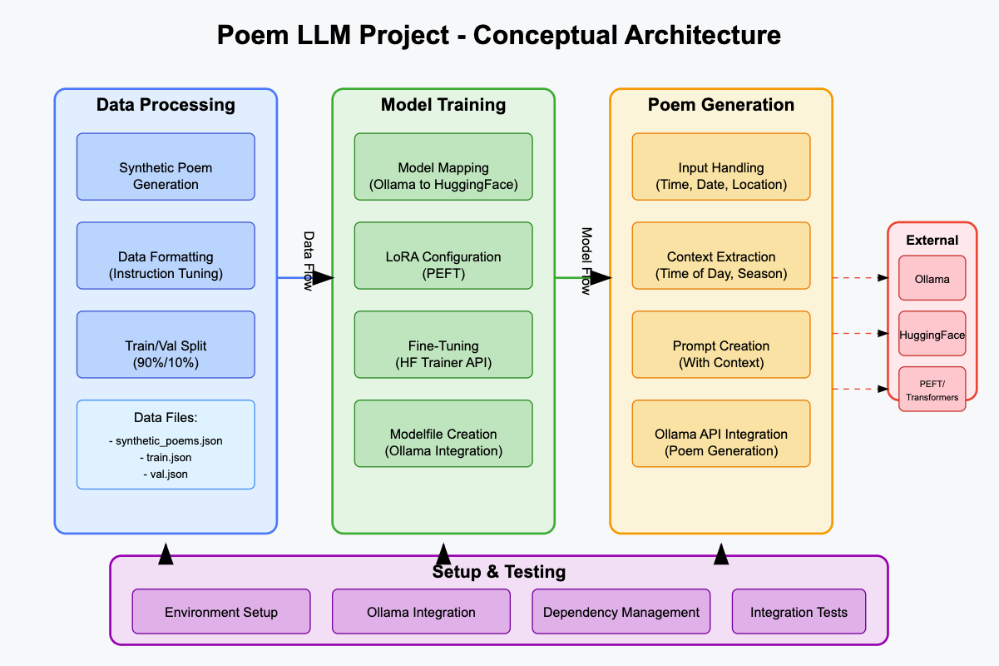

# Poem Generator LLM Project



A project to fine-tune a small LLM using LoRA on Ollama to generate poems based on time, date, and location inputs. The project works with Python 3.12+ and uses Ollama to interface with local LLMs.

## Project Structure

- `data/raw`: Raw poem datasets
- `data/processed`: Processed and formatted data for training
- `src`: Source code for the project
- `scripts`: Utility scripts for data processing and model training
- `venv`: Virtual environment (created during setup)

## Setup

The easiest way to set up the project is to use the included setup script:

```
./setup.sh
```

This script will:
1. Create and activate a virtual environment
2. Install all dependencies from requirements.txt
3. Check if Ollama is installed and running
4. Verify that the required base model (llama3.1:8b) is available
5. Optionally run an integration test

If you prefer to set up manually:

1. Create and activate a virtual environment:
```
python -m venv venv
source venv/bin/activate
```

2. Install dependencies:
```
pip install -r requirements.txt
```

3. Ensure Ollama is installed with the base model:
```
ollama list
```

## Requirements

- Python 3.12+
- Ollama installed and running
- Base model llama3.1:8b pulled in Ollama

## Usage

Always activate the virtual environment before using the project:
```
source venv/bin/activate
```

1. Process data:
```
python scripts/process_data.py
```

2. Fine-tune model:
```
python scripts/train_model.py
```

3. Generate poems in interactive mode:
```
python src/generate_poem.py --interactive
```

4. Or generate a specific poem:
```
python src/generate_poem.py --model llama3.1:8b --time "18:30" --date "2023-10-21" --location "Paris"
```

## Examples

Here are some examples of poems generated by the fine-tuned model:

### Example 1: Morning in Reno

**Input:** 9:57 AM, Sat Mar 1, Reno NV

**Output:**
```
"Desert Dawn's Gentle Hush"

In Reno's morning light, where Truckee's river flows,
A new day stirs, with Sierra's snowy glows.
At 9:57, the sun ascends to greet the day,
With warmth that whispers through the desert's way.

The High Desert's silence breaks, as dawn's sweet song
Echoes through the streets, where neon lights are strong.
The aroma of coffee wafts, a morning treat,
As gamblers and dreamers rise, their spirits to greet.

The mountains stand sentinel, a rugged, rocky shore,
Where snow-capped peaks meet skyward, evermore.
The Truckee River's gentle voice, a soothing melody plays,
As Reno awakens, to seize the day's bright gaze.

In this high desert oasis, where the Nevada sun shines bright,
A new year dawns, with promise, hope, and endless light.
March 1st's arrival brings renewal, rebirth, and might,
To this city built on dreams, where hearts take flight.

As morning's beauty slowly unfurls, like a rose in bloom,
Reno's vibrant spirit stirs, with a gentle, loving tune.
In this moment, all is calm, as the world awakens slow,
And the desert's secrets whisper, of a day yet to be sown.
```

### Example 2: Morning in Wheeling

**Input:** 10:01 AM, Sat Mar 1, Wheeling WV

**Output:**
```
"River City Rhapsody"

On March's first morning, in Wheeling's gentle light,
At 10:01, the Ohio River's waters shine so bright.
The city stirs, with a quiet reverence, as dawn's warm rays
Awaken the hills and valleys, in a peaceful, lazy way.

The Point Park Bridge stretches, like a silver thread,
Connecting West Virginia to Ohio, where the river is fed.
The National Road, a historic path, once led pioneers west,
Now guides tourists and locals, through Wheeling's rich history and rest.

In this steel city town, where industry once thrived,
A new era unfolds, with heritage preserved and alive.
The Chesapeake & Ohio Railroad Station stands as a testament,
To the transcontinental dreams, that shaped America's progress and quest.

At 10:01 on March 1st, the morning air is crisp and clean,
As Wheeling's riverfront awakens, to a fresh new scene.
The scent of coal smoke wafts, like memories of old,
As the city rises, with stories yet untold.

In this charming Ohio River town, where history meets the present day,
A sense of community thrives, in a warm and welcoming way.
Wheeling's spirit is resilient, forged from steel and coal,
And on March 1st's morning dew, its beauty starts to unfold.
```

## Models

The project works with the following Ollama models:
- llama3.1:8b (recommended base model)
- You can also use any other LLM available in your Ollama installation
- After training, you can create a custom model following the Modelfile template in test_model/

## Testing

Run the integration test to verify your setup:
```
python scripts/test_integration.py
```

This will:
- Check if Ollama is installed and running
- Process a small test dataset
- Create a sample Modelfile
- Generate a test poem

## License

[MIT License](LICENSE)
